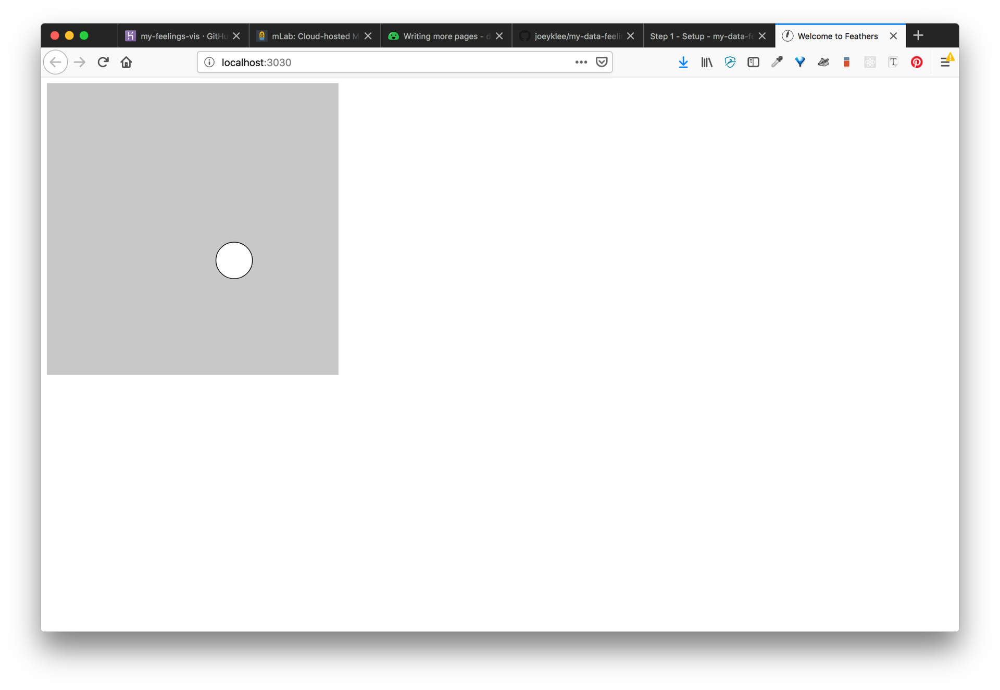

# Step 1: Setup

## Platforms as services

###  Heroku
> To deploy this application, we will be using Heroku - platform as a service that has generous free sandbox time to create and test applications. Also great is that it ships with HTTPS out of the box, so you don't have to worry about this.

==> Register here: https://heroku.com

(I haven't tested glitch.me for this application, but it could be a cool solution as well.)

### mLab
> Heroku is great, but it will just run our server application, but not take care of our data storage for Mongodb. Heroku has what are called "add-ons" that you can add on to your application that allow you to work with databases that aren't supported by Heroku. In this case we use a database as a service called mLab. 

==> Register here: https://mlab.com/


## Install homebrew 
> Homebrew is a package manager for mac - it helps you install things!

Open up your terminal. Copy and paste the following and press enter:

```
/usr/bin/ruby -e "$(curl -fsSL https://raw.githubusercontent.com/Homebrew/install/master/install)"
```


## Install Node.js 
> Install node.js using homebrew (the package manager we just installed) - a server side programming language/environment

After that finishes installing (you may be prompted to install things like XCode in the process), then copy and paste the following:

```
brew install node
```

## Install Mongodb
> Mongodb a mondern and frequently used database used in web applications.  see: https://treehouse.github.io/installation-guides/mac/mongo-mac.html

Use `brew install` to install mongodb. 

```sh
brew install mongodb
```

Make a data folder where your mongodb will live
```sh
sudo mkdir -p /data/db
```

Make sure you have the right permissions
```sh
sudo chown -R `id -un` /data/db
# Enter your password
```


## Run Mongodb
> The way databases work is that you install them, then "run" them. Data bases are like any other software, they need to be on/alive for you to use them. In this case we need to start mongodb so we can use it for our applicaiton!

In your commandline run:
```sh
mongod
```

This will start up mongodb on your machine! You now have mongodb running on your machine. The default `mongodb` port runs at `mongodb://localhost:27017`. When you use mongodb, you will send data from you application to mongodb through this port connection. 

## Generate the feathers app
> Web applications are hard to build. Often times you do the same things over and over again. This is where project generators come in. 

Feathers.js is a modern web application framework for generating node/express apps. Feathers comes with a commanline tool to help you generate applications and handling difficult things like authentication and setting up database connections. We will download the commandline tools and then create our application

```sh
# install the feathers command line scaffolding interface
npm install -g @feathersjs/cli

# make a project folder
mkdir my-project-name

# change directories
cd my-project-name

# create the app scaffold:
feathers generate app

? Project name my-project-name
? Description
? What folder should the source files live in? src
? Which package manager are you using (has to be installed globally)? npm
? What type of API are you making? (Press <space> to select, <a> to toggle all,
<i> to invert selection)REST, Realtime via Socket.io
? Which testing framework do you prefer? Mocha + assert

```

## Add p5js to your `/public/index.html` file

add your p5.js library and a `index.js` file 
in public/index.html
```
<script src="https://cdnjs.cloudflare.com/ajax/libs/p5.js/0.7.3/p5.min.js"></script>
<script src="https://cdnjs.cloudflare.com/ajax/libs/p5.js/0.7.3/addons/p5.dom.js"></script>
<script src="https://cdnjs.cloudflare.com/ajax/libs/p5.js/0.7.3/addons/p5.sound.min.js"></script>
<script src="index.js"></script>
```

## Add boilerplate p5 code to index.js 

Just to check if things are working, add some P5 code in.

```js
function setup(){
    createCanvas(400, 400)

}

function draw(){    
    background(200);
    ellipse(mouseX, mouseY, 50, 50);

}
```

## Checkpoint 1: Check to see if your app is running

run `npm run dev` in the root directory. If all goes well you'll see that your app is running on: `localhost:3030`

You should see something like:

